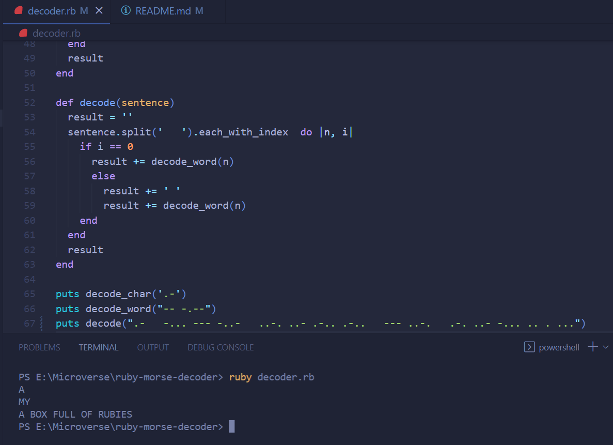

 

# ruby-morse-decoder
In this projetc we will create a simple ruby function to decode morse messages.

# Requirements for this project

Please find the requirements for this project [here](https://github.com/microverseinc/curriculum-ruby/blob/main/simple-ruby/morse_code.md).

# screenshot 
Final Output

## Installation & Usage

- You need to have `git` and `ruby` installed on your local computer.
- Clone the repository by running `git clone https://github.com/mukhammadrizooff/Morse-Code.git`
- Run the command `ruby decoder.rb` to see the result. 

## Technologies

- Ruby

## Authors

👤 **Omar Ragheb**

- GitHub: [https://github.com/omar25ahmed](https://github.com/omar25ahmed)
- LinkedIn: [https://www.linkedin.com/in/omar-ragheb/](https://www.linkedin.com/in/omar-ragheb/)
- Twitter: [https://twitter.com/Omar25Ahmed](https://twitter.com/Omar25Ahmed)

👤 **Behnam Aghaali**

- GitHub: [https://github.com/Behnam1369](https://github.com/Behnam1369)
- LinkedIn: [https://www.linkedin.com/in/behnam-aghaali](https://www.linkedin.com/in/behnam-aghaali)
- Twitter: [https://twitter.com/behnamagh1369](https://twitter.com/behnamagh1369)
- Email: [behnam.aghaali@yahoo.com](mailto:behnam.aghaali@yahoo.com)

## 🤝 Contributing

Contributions, issues, and feature requests are welcome!

Feel free to check the [issues page](../../issues/).

## Show your support

Give a ⭐️ if you like this project!

## Acknowledgments

- Hat tip to anyone whose code was used
- Inspiration
- etc

## 📝 License

This project is [MIT](./MIT.md) licensed.